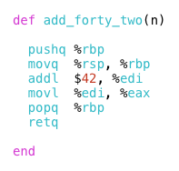
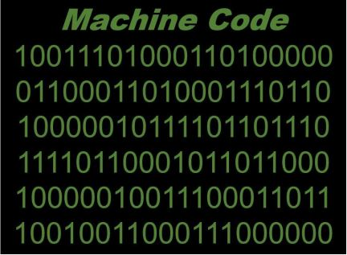
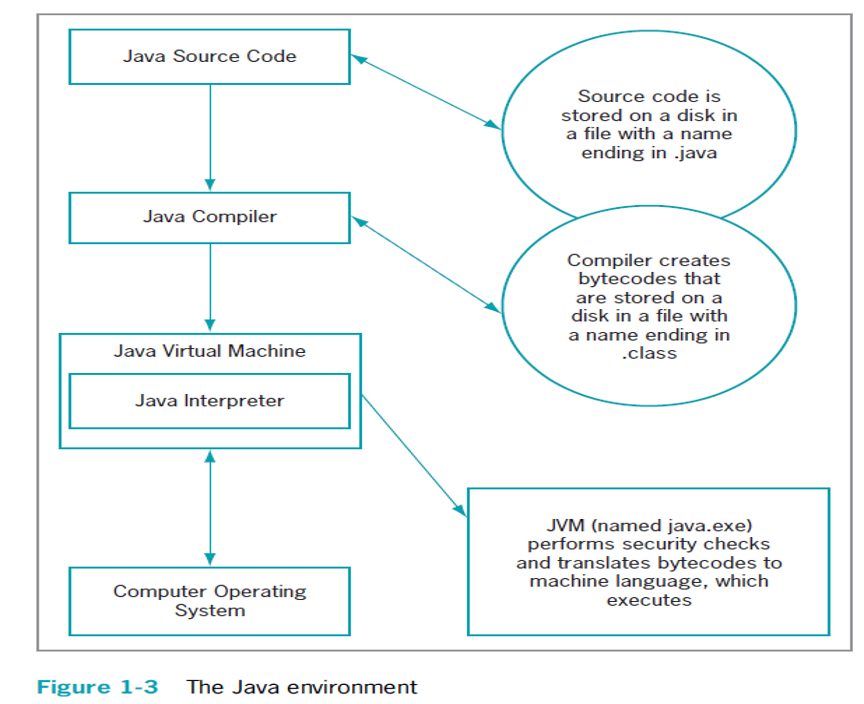
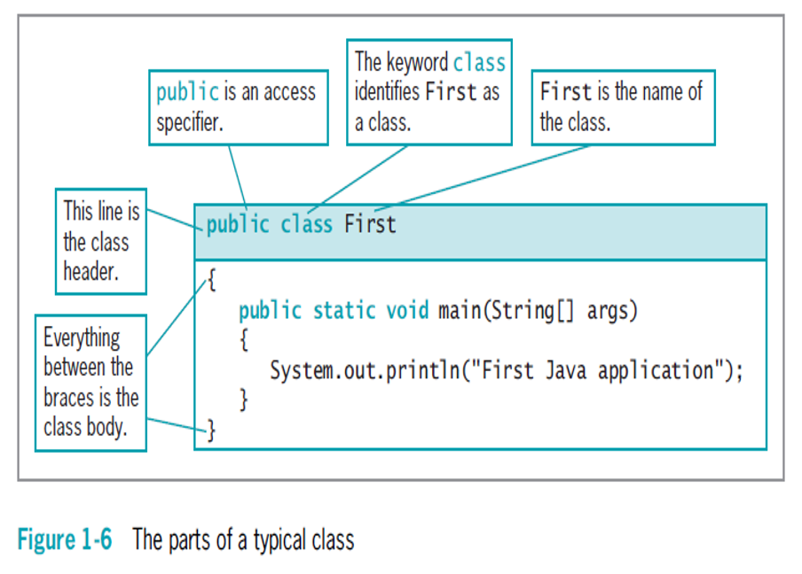
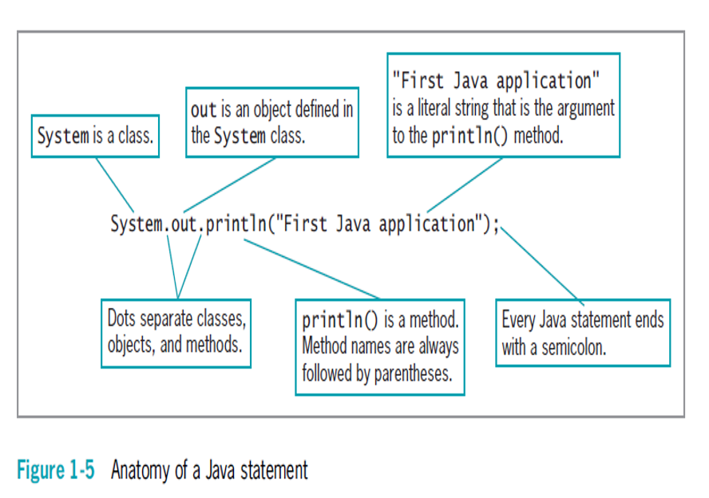
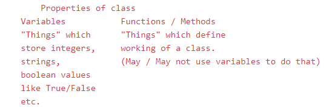

# Beginners Course

## What we are trying to cover
- Basic Java & Python lanaguage programming
- Data Structures
- Algorithms
- Competitive Programming
- Basics of Databases - SQL and NoSQL
- Basic Web development with HTML, CSS, Basic JavaScript, Materialize and Server Side Scripting with Java and Python
- Basic Android Development with Java
- Basic Networking Concepts
- Basic Virtualization Concepts
- Basic of Search Engines
- Basic Machine Learning and Big Data Analytics
- Basic Linux 
- Basic Bash scripting 
- Basics of Database performance optimization
- Basic Git - Pull, Commit, Add, Push, Adding Reviewers, Rebase, Using Wiki, Tracking projects, Using Issues section, Diffs
- Basic use of IntelliJ, Pycharm, Sublime, Vim

## Week1

- Installation
    - Download and install Java
    - Download and install Sublime Text
    - Download IntelliJ IDEA
- Configure 
    - Make changes to Sublime Text to execute Java code
- Execute Java Code
    - Execute "Hello World" program using Java on Sublime Text
- Git and Github
    - Create a Github account
    - Create a repository . Can name it "programming"
    - Create a folder "Week1"
    - **Do it with a friend** Add him as a collaborator to your repo
    - Add Hello World Java code file to this Week1
    - Add some description if any for your code
    - Browse down and select the option "Create a new branch for this commit and start a pull request."
    - Create this pull request with name Week1 and then add your friend as reviewer
    - Done! Wait for him to review what you have done . If he leaves a comment work on it( You will recieve an email that he left a comment or if it has been approved) otherwise we move to Week 2

## Week 2

- Things to know from task 1 and task 2
    - In computer science we have two types of languages, a **high-level** language and a **low-level** language. Machines only     understand 0s and 1s. In fact, your mouse clicks and execution of programs actually goes in as 0s and 1s which are then executed by the machine. Low level languages map very closely this code. Example - Assembly language and Machine Language. High-level languages provide a extra layer of abstraction but provide the same functionality. High level languages like Java, Python, C, C++  .. . . and so on. See https://youtu.be/bUWCD45qniA. 
    - Java is one of the early **high-level** languages in computer science. It is considered as a fully **Object-oriented** programming language, meaning you have "classes (or templates)" and "objects(or instances)" of those classes. See this example for a sample class and their object and using this object. 
    - 
    - Sublime is a very fast text editor preferred for Windows platforms. It has plugins to code various programming languages. 
    - IDEA is to manage your complex projects involving several java files. You may be interacting with different classes and IntelliJ provides a good interface with extra functionality to manage your classes efficiently.
    - Understanding your program 
      - In Java everything stays inside a "class".
      - "class" - A class is a template. In your case, a template for hello world. 
      - "public" - These specify access . Meaning? Access level of your code. When a class member(class name,variable name, function name etc.) is preceded by public, then that member may be accessed by code outside the class in which it is declared. There are several access specifiers like public, private, protected, etc.
      - "static" - The keyword static allows main( ) to be called without having to instantiate a particular instance of the class.
      - "void" - The keyword void simply tells the compiler that main( ) does not return a value
      - "main" - Every "java javafile" execution will search for this "function". A function is a property of a class. Here the property of "HW" class is that it can print "Hello world".
      - String[ ] args declares a parameter named args, which is an array of instances of the class String.  args receives any number of command-line arguments.
      -  
    - Things learned from Task 4
      - Git is one of the most important tools to work with in today's CS world. It allows you to version your code, allows collaboration with others on the same codebase and many other things. It is imperative you follow tutorials closely (See Resources section for Github resources). Github is just a software/application running Git. There are many out there. I have worked with 4 of them - Mercurial, Github, Gitlab, Bitbucket.

- To Do
    - Now that you have a basic understanding about variables, let's try to learn about variables, data types and functions in java programming and how you define them. For this
      - Learn from online sources on how to define variables, what are variables, what are data types, what are functions.
      - Add to Github another file called "variables.java" and write a program that adds two numbers, subtracts them, multiplies them and divides them and print all the results.
      - Add to Github another file called "variables2.java" and write a program that asks from the user whether he likes "coffee" or not? If he doesn't, print that the user does not like coffee.
      - Add to Github another file called "variables3.java" and save your name in a variable and then print that name using System.out.println() statement we have seen earlier.
      - Add to Github another file called "AnotherFunction.java" and call another function from your main() funtion and
        - Print your name there. Define a variable in the other function.
        - Send two numbers and add them in the other function and print the result.                             
    - Complete the Java programming course - https://www.codecademy.com/learn/learn-java
    - Complete the following coding problems and post the answer on Github. 
      - Write a function that checks whether an element occurs in a list.
      - Write a function that returns the largest element in a list.
      - Write a program that prints if a number is even and prints if it is odd.

## Resources

- General
    - https://www.youtube.com/channel/UCmJz2DV1a3yfgrR7GqRtUUA 
    - https://www.youtube.com/channel/UCM-yUTYGmrNvKOCcAl21g3w
    - https://www.youtube.com/user/tusharroy2525
    - https://www.youtube.com/channel/UC1fLEeYICmo3O9cUsqIi7HA
    - http://tutorials.jenkov.com/ For understanding basic of threds.
    - Books in /books folder
- Week 1
    - Java Installation https://www.youtu.be/bll48gbFiEc
    - About Github (Good series to learn about Git and Github) https://www.youtube.com/watch?v=BCQHnlnPusY 
    - Adding Collaborators to Github repo ( https://help.github.com/en/articles/inviting-collaborators-to-a-personal-repository )
    - Adding reviewer https://help.github.com/en/articles/requesting-a-pull-request-review
- Week 2
    - C and C++ are closer to low level languages as they allow a good level of memory management. However, with human errors this memory management if not done properly can lead to memory exhaustion. Also, C and C++ use concepts like 'pointers' which point to actual locations of objects in memory. This can lead to security issues as we are now trying to interact with the underlying hardware. Java on the other hand allows for automatic memory management for the most part and does not allow pointers. 
    - See https://youtu.be/QXjU9qTsYCc.
    - https://www.geeksforgeeks.org/school-programming/
